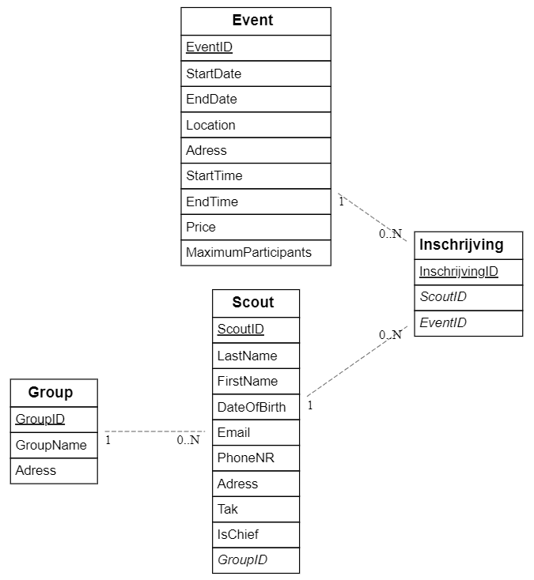
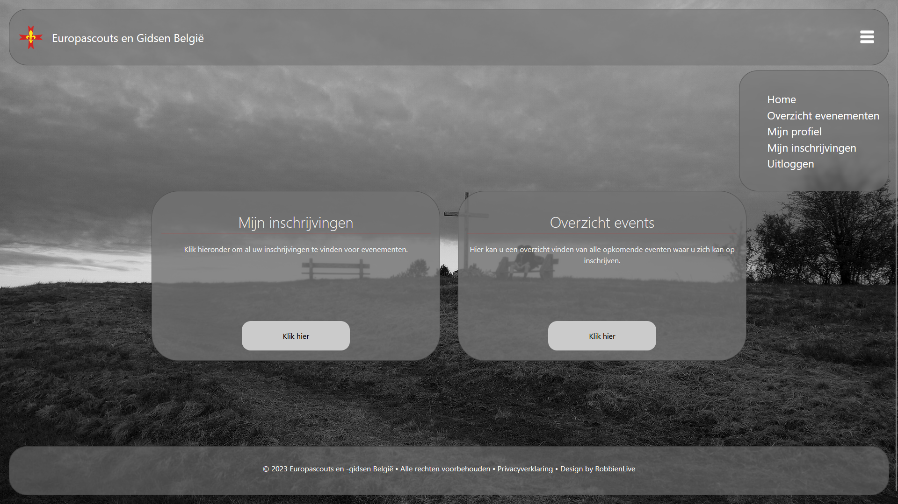
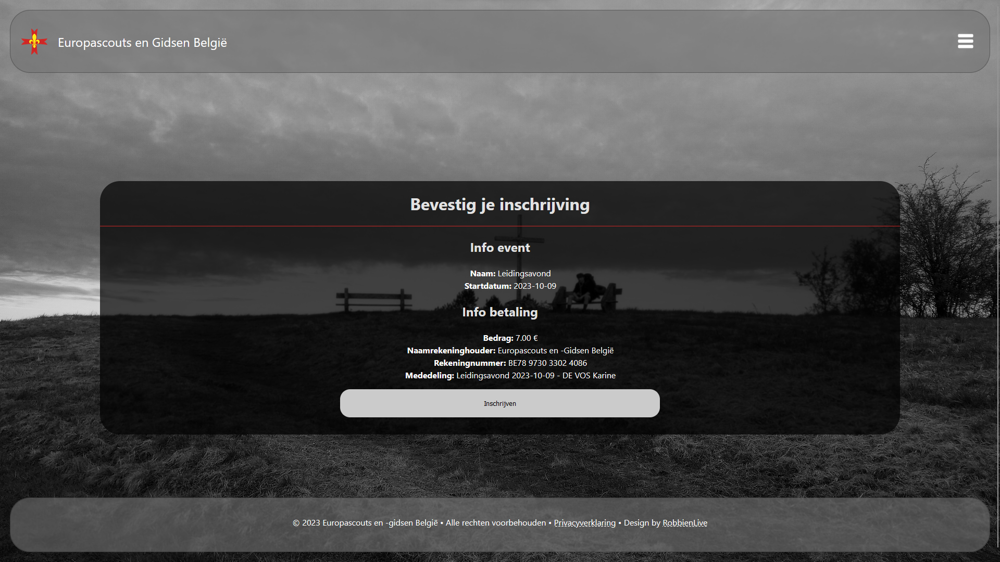
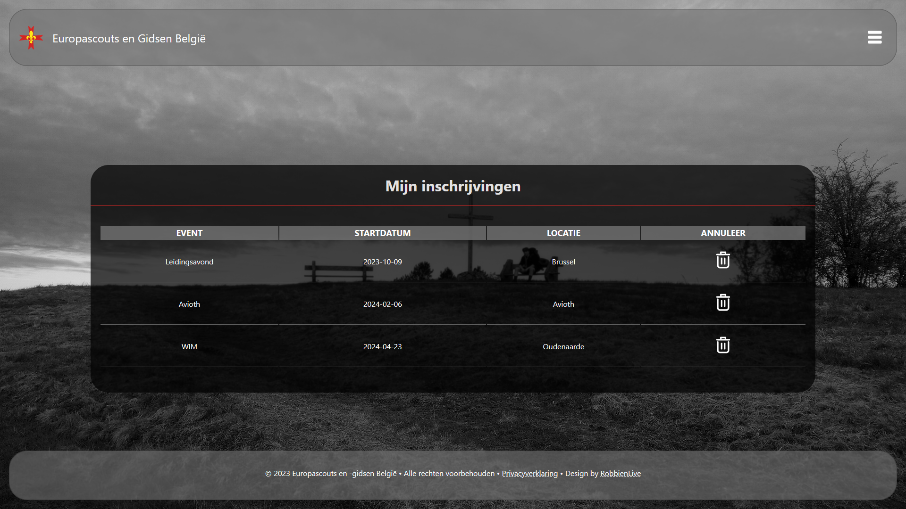
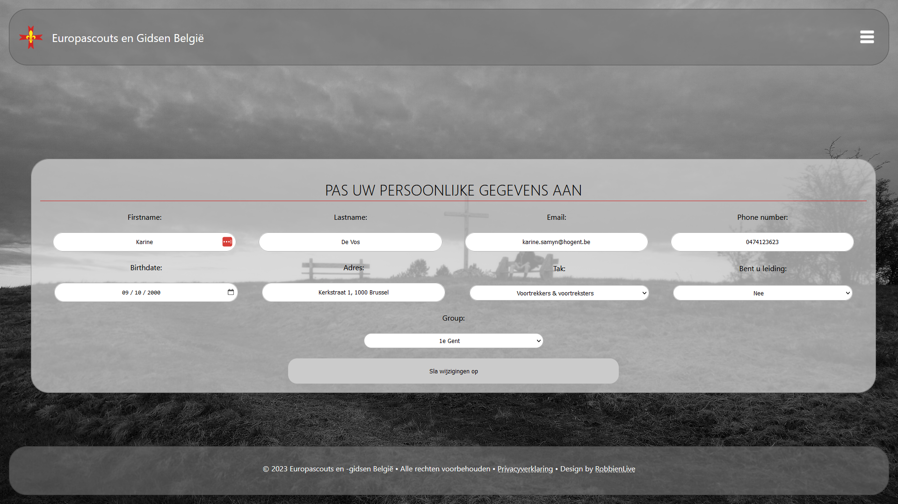
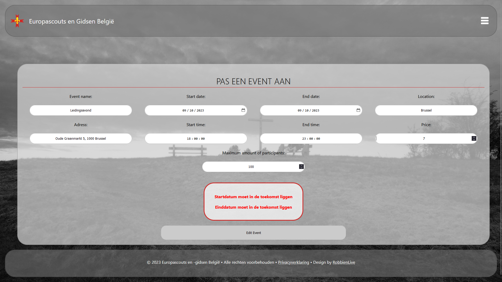
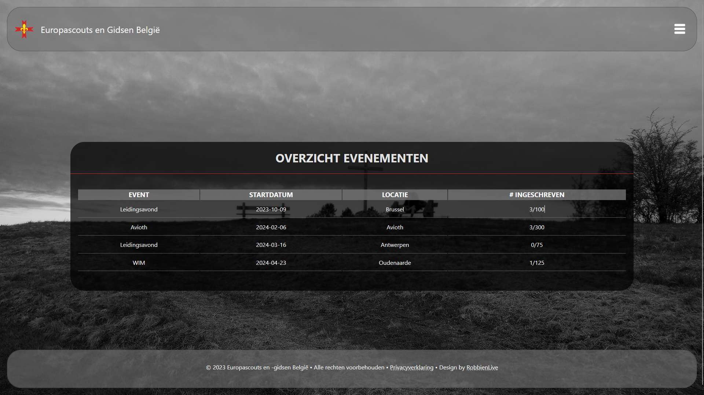
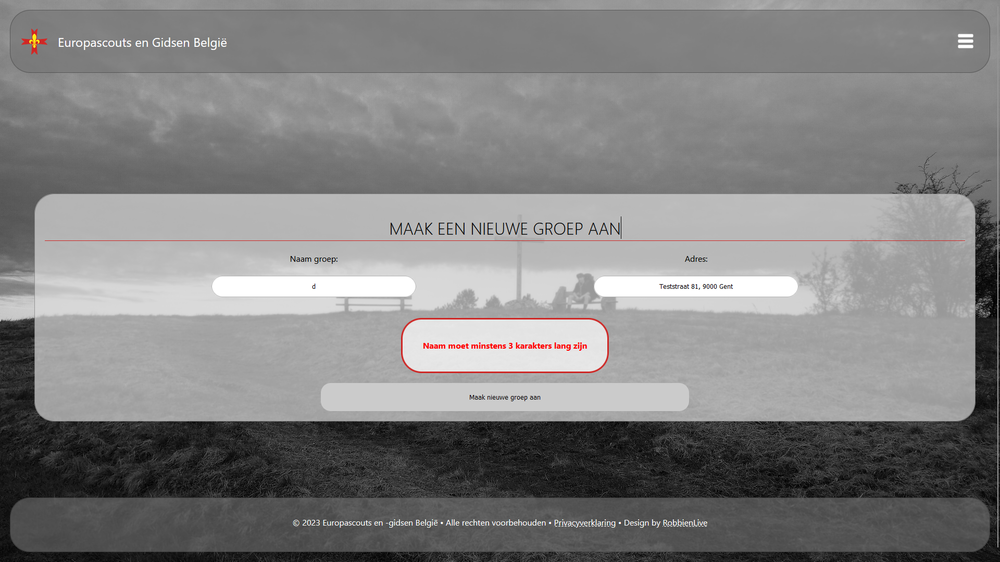
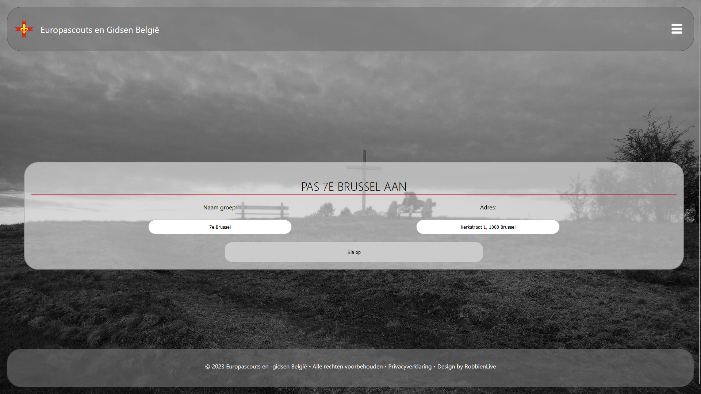
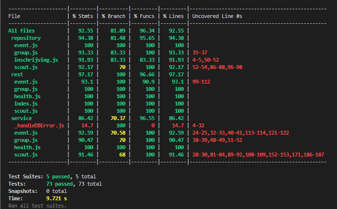

# Robbe Van Duysen (202289876) - *Front-end web development en webservices*
- [x] Front-end Web Development
  - <https://github.com/Web-IV/2324-frontendweb-RobbienLiveStudent>
  - <https://two324-frontendweb-robbienlivestudent.onrender.com/>
- [x] Web Services: GITHUB URL
  - <https://github.com/Web-IV/2324-webservices-RobbienLiveStudent>
  - <https://two324-webservices-robbienlivestudent.onrender.com>

**Logingegevens**

\*Normale gebruiker (rol: user):

- E-mailadres: `test1@tester.com`
- Wachtwoord: `Wachtwoord1$`

_Administrator (rol: admin en user):_

- E-mailadres: `robbe.vanduysen@gmail.com`
- Wachtwoord: `12345678`

> Er is de mogelijkheid om nieuwe gebruikers (met rol: user) aan te maken. Deze kunnen dan inloggen met de gegevens die ze zelf hebben ingegeven. 
> Eventueel kan u zelf een nieuwe gebruiker aanmaken en deze gebruiken om in te loggen.

## Projectbeschrijving

Mijn bedoeling met dit project was om een systeem te ontwikkelen waarop scouts zich konden inschrijven voor evenementen die op nationaal georgaseerd worden. Op dit moment wordt er gebruik gemaakt van [Assoconnect](https://gseb.assoconnect.com/page/870136-accueil-onthaal). Hierop heb ik mij dan ook voornamelijk gebaseerd om de functionaliteiten te bepalen.

### Functionaliteiten

- Algemeen

  - Aanmaken van een nieuwe gebruiker/scout
  - Inloggen met een bestaande gebruiker
  - Bekijken van evenementen

- Gebruiker/scout

  - In- en uitschrijven voor een evenement
  - Eigen gegevens bekijken en aanpassen
  - Bekijken van de evenementen waarvoor je bent ingeschreven

- Administrator

  - Aanmaken van een nieuw evenement
  - Aanpassen van een bestaand evenement
  - Verwijderen van een bestaand evenement
  - Bekijken van alle scouts die ingeschreven zijn voor een evenement
  - Aanmaken van een nieuwe groep
  - Aanpassen van een bestaande groep
  - Verwijderen van een bestaande groep
  - Bekijken van alle scouts die lid zijn van een groep

### ERD

## Screenshots

### Algemeen

Homepagina met navigatiebar (_Past zichzelf aan naargelang de rol van de gebruiker en of deze al dan niet is ingelogd_)

Inloggen

Als iemand die is ingelogd, iets wilt verwijderen (groep, evenement, gebruiker) krijgt deze een bevestigingspagina te zien.

### Gebruiker/scout

Homepagina met navigatiebalk

Evenementen

Ovezicht ingeschrijvingen

Bekijken en aanpassen van eigen gegevens

### Administrator

Homepagina met navigatiebalk

Overzicht evenementen met optie om een nieuw evenement aan te maken

Formulier om een nieuw evenement aan te maken

Info over een evenement met optie om dit aan te passen of te verwijderen

Aanpassen van een evenement met eventuele foutmelding

Overzicht evenementen met het aantal ingeschreven scouts

Overzicht groepen met optie om een nieuwe groep aan te maken, te verwijderen of aan te passen

Formulier om een nieuwe groep aan te maken met eventuele foutmelding

Formulier om een bestaande groep aan te passen

Overzicht van de leden ingeschreven in een groep

## API calls

### Group

- `GET /api/groups` : alle groepen ophalen
- `GET /api/groups/:id` : één bepaalde groep ophalen
- `POST /api/groups` : een nieuwe groep toevoegen
- `PUT /api/groups/:id` : een bestaande groep aanpassen
- `DELETE /api/groups/:id` : een bestaande groep verwijderen

### Scout

- `GET /api/scouts` : alle scouts ophalen
- `GET /api/scouts/:id` : één bepaalde scout ophalen
- `GET /api/scouts/group/:id` : alle scouts van een bepaalde groep ophalen
- `POST /api/scouts` : een nieuwe scout toevoegen
- `PUT /api/scouts/:id` : een bestaande scout aanpassen
- `DELETE /api/scouts/:id` : een bestaande scout verwijderen

### Events

- `GET /api/events` : alle events ophalen
- `GET /api/events/:id` : één bepaald event ophalen
- `POST /api/events` : een nieuw event toevoegen
- `PUT /api/events/:id` : een bestaand event aanpassen
- `DELETE /api/events/:id` : een bestaand event verwijderen

### Inschrijvingen

- `GET /api/events/inschrijvingen/:id` : alle inschrijvingen van een bepaald event ophalen
- `GET /api/events/inschrijvingen/scout` : alle inschrijvingen van een bepaalde scout ophalen
- `POST /api/events/inschrijvingen` : een nieuwe inschrijving toevoegen
- `DELETE /api/events/inschrijvingen/:id` : een bestaande inschrijving verwijderen

## Behaalde minimumvereisten

### Front-end Web Development

- **Componenten**

  - [x] heeft meerdere componenten - dom & slim (naast login/register)
  - [x] applicatie is voldoende complex
  - [x] definieert constanten (variabelen, functies en componenten) buiten de component
  - [x] minstens één form met meerdere velden met validatie (naast login/register)
  - [x] login systeem

- **Routing**

  - [x] heeft minstens 2 pagina's (naast login/register)
  - [x] routes worden afgeschermd met authenticatie en autorisatie

- **State-management**

  - [x] meerdere API calls (naast login/register)
  - [x] degelijke foutmeldingen indien API-call faalt
  - [x] gebruikt useState enkel voor lokale state
  - [x] gebruikt gepast state management voor globale state - indien van toepassing

- **Hooks**

  - [x] gebruikt de hooks op de juiste manier

- **Varia**

  - [x] een aantal niet-triviale e2e testen
  - [x] minstens één extra technologie
  - [x] maakt gebruik van de laatste ES-features (async/await, object destructuring, spread operator...)
  - [x] duidelijke en volledige README.md
  - [x] volledig en tijdig ingediend dossier en voldoende commits

### Web Services

- **Datalaag**

  - [x] voldoende complex (meer dan één tabel, 2 een-op-veel of veel-op-veel relaties)
  - [x] één module beheert de connectie + connectie wordt gesloten bij sluiten server
  - [x] heeft migraties - indien van toepassing
  - [x] heeft seeds

- **Repositorylaag**

  - [x] definieert één repository per entiteit (niet voor tussentabellen) - indien van toepassing
  - [x] mapt OO-rijke data naar relationele tabellen en vice versa - indien van toepassing

- **Servicelaag met een zekere complexiteit**

  - [x] bevat alle domeinlogica
  - [x] bevat geen SQL-queries of databank-gerelateerde code

- **REST-laag**

  - [x] meerdere routes met invoervalidatie
  - [x] degelijke foutboodschappen
  - [x] volgt de conventies van een RESTful API
  - [x] bevat geen domeinlogica
  - [x] geen API calls voor entiteiten die geen zin hebben zonder hun ouder (bvb tussentabellen)
  - [x] degelijke authorisatie/authenticatie op alle routes

- **Algemeen**

  - [x] er is een minimum aan logging voorzien
  - [x] een aantal niet-triviale integratietesten (min. 1 controller >=80% coverage)
  - [x] minstens één extra technologie
  - [x] maakt gebruik van de laatste ES-features (async/await, object destructuring, spread operator...)
  - [x] duidelijke en volledige README.md
  - [x] volledig en tijdig ingediend dossier en voldoende commits

## Projectstructuur

### Front-end Web Development

**Mappen:**

- cypress/e2e: `-> alle testen`
- screenshots_dossier: `-> alle screenshots die in dit dossier gebruikt worden`
- src:
  - api
  - components: `-> alle componenten`
    - event `-> alle componenten die met evenementen te maken hebben`
      - admin `-> alle componenten die enkel de admin kan zien (bv. aanmaken van een nieuw evenement)`
      - InfoEvent.jsx `-> component om de info van een evenement te tonen`
      - Inschrijvingen.jsx `-> component om effectief in te schrijven voor het evenement`
    - group `-> alle componenten die met groepen te maken hebben`
      - GroupList.jsx `-> component om een overzicht van alle groepen te tonen`
      - ScoutOfGroupList.jsx `-> component om een overzicht van alle leden van een bepaalde groep te tonen`
    - login `-> alles wat met inloggen te maken heeft`
    - scout `-> alles wat met scouts te maken heeft`
      - inschrijvingen `-> alle componenten die met inschrijvingen te maken hebben`
    - ...Algemene componenten `(bv. header, footer, ..., PrivateRoute)`
  - contexts
  - images
    - icons
  - pages
  - Root.jsx
  - main.jsx
  - index.css

### Web Services

**Mappen:**
- \_\_tests\_\_: `-> alle testen`
- config: `-> alle configuratiebestanden`
  - custom-environment-variables.js
  - development.js
  - production.js
- src: `-> alle code`
  - core: `-> alle core bestanden zoals auth.js, validatoin.js, ...`
  - data: `-> alles omtrent de databank`
    - migrations: `-> alle migraties`
    - seeds: `-> alle seeds`
  - repository: `-> alle repositories (van inschrijvingen, groepen, scouts, events)`
  - rest: `-> alle rest bestanden`
  - service: `-> alle service bestanden`
  - startup: `-> alle opstartbestanden`
  - utils: `-> alle hulpbestanden`
  - createServer.js
  - index.js
  - testjwt.js
  - testpw.js

## Extra technologie

### Front-end Web Development

- [PropTypes](https://www.npmjs.com/package/prop-types) om de props van een component te valideren
- [SheetJS (*xlsx*)](https://www.npmjs.com/package/xlsx) om een excel bestand te genereren

### Web Services

- [JSDoc](https://jsdoc.app/) om de code te documenteren

## Testresultaten

### Front-end Web Development

- Event:
  - Controleren of creeër knop aanwezig is (enkel voor admin)
  - Creeëren van een nieuw evenement met foute gegevens
  - Creeëren van een nieuw evenement met correcte gegevens
  - controleren of het evenement is toegevoegd aan de lijst
  - aanpassen van een evenement
  - controleren of het evenement is aangepast
  - verwijderen van een evenement
- Group:
  - Aanmelden als user (kan geen groepen aanmaken, enkel admin)
  - Aanmakken van een nieuwe groep met eerst foute gegevens, dan correcte gegevens
  - aanpassen van de info van een groep
  - Verwijderen van een groep
- Inschrijving:
  - Inschrijven voor een evenement
  - Verwijderen van een inschrijving
- Scout:
  - Mogelijk om naar registratiepagina te gaan
  - Registreren met foute gegevens
  - Registreren met correcte gegevens
  - Inloggen
  - Aanpassen van gegevens
- Spec:
  - Kijk of server online is

### Web Services

Events:
- GET all events
- GET by ID
  - ID bestaat
  - ID bestaat niet *-> faalt*
  - ID is geen nummer *-> faalt*
- POST
  - Door admin
  - Door user *-> faalt*
  - Zonder token *-> faalt*
- PUT
  - Door admin
  - Door user *-> faalt*
  - Zonder token *-> faalt*
- DELETE
  - Door admin
  - Door user *-> faalt*
  - Zonder token *-> faalt*

Groups:
- GET all groups
- GET by ID
  - ID bestaat
  - ID bestaat niet *-> faalt*
- POST
  - Door admin
  - Door user *-> faalt*
  - Zonder token *-> faalt*
- PUT
  - Door admin
  - Door user *-> faalt*
  - Zonder token *-> faalt*
- DELETE
  - Door admin
  - Door user *-> faalt*
  - Zonder token *-> faalt*
  
Heathcheck:
- GET ping
  - return pong
- GET version
  - controleerd env, version en name

Inschrijvingen:
- GET all inschrijvingen van een event
  - Door admin
  - Door user *-> faalt*
  - ID is geen nummer *-> faalt*
  - Zonder token *-> faalt*
- GET all inschrijvingen van een scout
  - Door user (eigen ID)
  - Zonder token *-> faalt*
- POST
  - Door user (eigen ID)
  - Zonder token *-> faalt*
- DELETE
  - Door user
  - Zonder token *-> faalt*

Scouts:
- GET all scouts
  - Door admin
  - Door user *-> faalt*
  - Zonder token *-> faalt*
- GET by ID
  - Door user (eigen ID)
  - Door user (andere ID) *-> faalt*
  - ID bestaat niet *-> faalt*
  - ID is geen nummer *-> faalt*
  - Zonder token *-> faalt*
- POST
- PUT
  - Door user (eigen ID)
  - Door user (andere ID) *-> faalt*
  - ID bestaat niet *-> faalt*
  - ID is geen nummer *-> faalt*
  - Zonder token *-> faalt*
- DELETE
  - Door admin
  - Door user *-> faalt*
  - Zonder token *-> faalt*
  - ID bestaat niet *-> faalt*
  - ID is geen nummer *-> faalt*
- GET by group ID
  - Door admin
  - Door user *-> faalt*
  - Zonder token *-> faalt*

## Gekende bugs

### Front-end Web Development

- Als de jwt token expired is, wordt de gebruiker niet automatisch uitgelogd. De gebruiker kan dan nog steeds de pagina's bezoeken waarvoor hij/zij geautoriseerd was, maar geen gegevens ophalen vanuit de databank.

### Web Services

- /